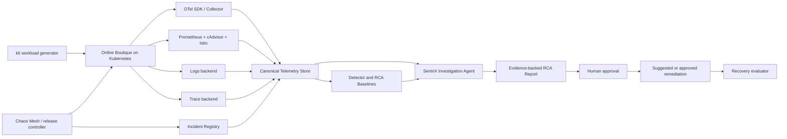

# SentriX Final — 프로젝트 맥락 및 개발 방향

## 1. 프로젝트 정의

**SentriX**는 Kubernetes 기반 마이크로서비스에서 서비스 성능 저하를 탐지하고, metrics·logs·traces·Kubernetes events·서비스 topology를 조사해 근거와 함께 원인 후보 순위를 제시하는 human-in-the-loop observability RCA agent이다.

이 프로젝트의 목표는 Dynatrace나 Datadog 전체를 재현하는 것이 아니다. 통제된 Online Boutique 환경에서 상용 observability agent의 핵심 조사 loop를 구현하고 평가하는 것이다.

```
성능 저하 탐지
  → incident 범위 확정
  → telemetry와 topology 조사
  → 원인 가설 생성 및 검증
  → 근거 기반 RCA 결과 제시
  → 사람 승인형 조치 제안
  → recovery 확인
```

### 핵심 연구 질문

1. 다중 telemetry를 사용해 통제된 fault 상황에서 root-cause service 또는 dependency edge를 찾을 수 있는가?
2. 정적 데이터셋 답변이 아니라, alert 후 구조화된 telemetry query를 수행하는 agent를 만들 수 있는가?
3. latency/error 같은 증상과 실제 injection cause를 구분할 수 있는가?
4. Vendor recovery signal이 독립된 사용자 여정 관측과 얼마나 일치하며, 제한된 실험 범위에서 recovery 평가에 사용할 수 있는가?

## 2. 범위와 비목표

### 포함 범위

- Kubernetes에 배포한 Online Boutique.
- Metrics, logs, traces, Kubernetes events, topology 수집.
- Chaos Mesh와 통제된 workload generator를 이용한 fault injection.
- Ground truth, fault lifecycle, 영향, recovery를 기록하는 incident registry.
- RCAEval RE2-OB 및 자체 수집 데이터셋에서의 offline RCA 평가.
- 제한된 tool을 사용해 데이터를 조회하고 근거 기반 보고서를 생성하는 live investigation agent.
- 사람 승인 기반 remediation 제안. 첫 버전은 조치를 제안만 해도 된다.

### 첫 릴리스에서 제외할 범위

- Datadog/Dynatrace 규모의 multi-tenant backend, cloud integration, 장기 운영 플랫폼.
- 사람 승인 없는 destructive remediation.
- Multi-cluster 및 실제 production cloud 배포.
- OSI L1/L2 물리 네트워크, host-wide kernel, block-device-wide fault.
- Grafana, Jaeger, Loki를 대체하는 자체 dashboard.

## 3. 두 개의 데이터 전략

SentriX는 서로 다른 질문에 답하는 두 데이터 lane을 사용한다. 둘을 하나의 데이터셋으로 혼동하지 않는다.

| Lane | 목적 | 데이터 원천 | 주요 평가 |
| --- | --- | --- | --- |
| **Benchmark lane** | 비교 가능한 offline RCA 평가 | RCAEval RE2-OB | 공개 benchmark case의 root-cause ranking |
| **Product lane** | Live observability agent 설계 및 평가 | 자체 수집 Online Boutique telemetry | 탐지, 조사 품질, recovery, 조치 제안 |

### 3.1 Benchmark lane: RCAEval RE2-OB

RE2-OB는 Online Boutique의 failure case 90개를 담고 있다. 5개 target service × 6개 fault type (`cpu`, `mem`, `disk`, `delay`, `loss`, `socket`) × 3회 반복 구조이며, metrics, logs, traces, root-cause service, fault type, injection timestamp를 제공한다. 공식 Parquet 배포본은 원래 JSON/CSV 데이터를 손실 없이 변환한 것이다. RCAEval dataset card

RE2-OB는 다음에 사용한다.

- Baseline 비교와 regression test.
- Metrics, logs, traces adapter 검증.
- Case-level train/validation/test split.
- Service-level root-cause ranking.

단, RE2-OB에는 검증된 fault 종료 시각이나 recovery 완료 라벨이 없으므로 **recovery 평가나 action outcome 평가는 자체 데이터로 해야 한다.**

### 3.2 Product lane: 자체 수집 incident 데이터

직접 구성한 Kubernetes 환경은 telemetry뿐 아니라 **운영형 agent 평가**에 필요한 사실을 함께 기록한다.

- fault start/end와 injector 상태;
- target pod, service, dependency edge, release;
- workload profile과 실제 request rate;
- user-impact 기준과 최초 impact 시각;
- vendor monitor recovery/problem 종료 시각과 independent synthetic transaction 결과;
- agent query, 가설, 근거, 조치 제안;
- 사람 feedback과 action outcome.

이 lane은 RE2-OB의 주된 한계를 보완한다. 즉, 통제 가능한 workload, deployment/change metadata, 명시적인 incident lifecycle, recovery 후보 신호와 그 독립 검증 증거를 제공한다. Vendor의 monitor recovery 또는 problem 종료 시각은 서비스 복구의 ground truth로 가정하지 않는다.

## 4. 시스템 아키텍처



### 수집 구성요소의 책임

| 구성요소 | 책임 |
| --- | --- |
| OTel SDK / Collector | Application traces, logs, application metrics, resource metadata, service identity |
| Prometheus / cAdvisor / Istio | Resource, container, service, mesh metrics 및 RCAEval 계열 metric 호환성 |
| Trace backend | Trace/span 저장 및 dependency 추출 |
| Logs backend | Raw application/platform log 저장 |
| Chaos Mesh | Fault injection만 담당. telemetry schema를 만들지 않음 |
| Incident Registry | Experiment/incident label의 source of truth |
| SentriX agent | 제한된 조사 workflow와 evidence synthesis |

## 5. Telemetry identity와 정규화

OTel 및 Kubernetes metadata는 아래 identity를 기본으로 사용한다.

```
service.namespace
service.name
service.instance.id
service.version
deployment.environment.name
k8s.namespace.name
k8s.deployment.name
k8s.pod.uid
```

`service.name`은 논리 서비스, `service.instance.id`는 실행 중인 개별 instance를 나타낸다. OTel service semantic conventions

Kubernetes Attributes Processor는 trace, log, metric에 pod, namespace, deployment, node metadata를 보강할 수 있다. Kubernetes Attributes Processor

### Canonical service model

모든 record에는 원본 identity와 정규화 identity를 함께 저장한다.

```
telemetry_source: metrics | logs | traces
raw_service_id: frontendservice
canonical_service_id: frontend
mapping_version: 1
```

Normalization adapter는 버전 관리되고 검토된 alias map을 사용한다. 비슷한 이름만으로 같은 서비스라고 추정하지 않는다. Lookup 우선순위는 다음과 같다.

1. `service.namespace + service.name`
2. `k8s.namespace.name + k8s.deployment.name`
3. `k8s.pod.uid` 또는 `container.id`
4. Prometheus `pod`, `container`, `job` 같은 source-native label
5. 검토된 source-specific alias mapping

매핑되지 않은 identity는 조용히 병합하지 않고 validation error로 남긴다.

### Raw, canonical, benchmark view

```
Raw telemetry
  → Canonical long-format telemetry: agent와 live investigation용
  → RE2-compatible projection: benchmark 비교용
```

Canonical view는 풍부한 OTel attribute를 보존한다. RE2-compatible projection은 1초 metric window, service-level metric name, 최소 log field, 호환 가능한 trace field를 materialize한다. 두 경로 모두 raw value와 raw identity를 보존한다.

## 6. Incident registry와 라벨

`incident_id`는 registry에 저장하고 time, scope, canonical identity로 telemetry와 join한다. 새 incident마다 Prometheus time series가 늘어나는 high cardinality를 피하기 위해 metric label로 넣지 않는다.

### 필수 incident field

```yaml
incident_id: inc-2026-001
experiment_id: exp-cpu-rec-l2-r03
run_id: run-2026-001

fault:
  injected: true
  type: cpu_saturation
  cause_family: resource
  injection_layer: platform_compute
  scope_kind: service_instance
  root_cause_service: recommendationservice
  target_pod_uid: "..."
  started_at: "..."
  ended_at: "..."
  injector_status: succeeded

workload:
  profile: browse-cart-checkout-v1
  target_rps: 24
  actual_rps: 23.9
  dropped_iterations: 0

impact:
  confirmed: true
  critical_failure: latency_increase
  affected_endpoint: checkout
  impact_started_at: "..."

recovery:
  vendor_candidates:
    - source: datadog_monitor # 또는 dynatrace_problem
      source_id: "..."
      recovered_or_ended_at: "..."
  transaction_observation:
    profile: browse-cart-checkout-v1
    first_passing_at: "..."
    observation_status: pass # pass | fail | unknown
  evaluation_policy_version: v1
```

### 상태 라벨

| 상태 | 정의 |
| --- | --- |
| `normal` | Fault가 없고 workload별 SLO/baseline 기준을 만족한다. |
| `fault_active_no_impact` | Injection은 성공했지만 user impact가 확인되지 않았다. |
| `abnormal_impacted` | Fault가 활성 상태이며 user-impact 기준을 만족한다. |
| `recovery` | Fault는 끝났으나 recovery 기준은 아직 만족하지 않는다. |
| `recovered` | 사전 정의된 synthetic transaction 기준이 지정된 observation window 동안 유지된다. Vendor 상태는 보조 증거로 함께 기록한다. |

이 분리는 높은 CPU만으로 incident로 판단하거나, injection된 모든 fault를 service degradation으로 판단하는 오류를 막는다.

## 7. Layer model: injection과 observation의 분리

OSI 용어는 맞는 영역에서만 사용한다. CPU, memory, disk, pod, Kubernetes, deployment는 OSI model 밖에 있다.

| Fault | Injection layer | Observation layer | Root-cause scope |
| --- | --- | --- | --- |
| CPU saturation | Platform / compute | Platform + L7 latency | service instance |
| Memory pressure | Platform / compute | Platform + L7 error/latency | service instance |
| Pod failure | Kubernetes / process | Kubernetes + L7 availability | service instance |
| Network delay | L3/L4 | L7 span latency 및 timeout | dependency edge |
| Packet loss | L3/L4 | L7 retry/error 및 network metric | dependency edge |
| HTTP abort/delay | L7 | L7 trace/log/error | service endpoint/edge |
| Traffic surge | Workload / L7 | L7 throughput, latency, SLO | entrypoint 또는 endpoint |
| Faulty release | Deployment / L7 | L7 error/latency 및 version metadata | release/service |

모든 incident는 **injection layer**와 **observed symptom layer**를 모두 기록해야 한다. Latency 증가는 L7 symptom이며 그 자체가 root cause는 아니다.

Chaos Mesh는 pod/container fault, CPU/memory stress, network delay/loss/partition, file I/O fault, DNS fault, HTTP fault를 지원한다. Chaos Mesh capabilities

## 8. Fault taxonomy

Taxonomy는 증상과 원인이 아닌 상태 변화를 분리하는 상용 observability RCA 원칙을 따른다. 예를 들어 Datadog Watchdog은 version change, traffic increase, infrastructure failure, disk exhaustion을 root cause로 분류하고, latency/error 증가는 critical failure 또는 impact로 구분한다. Datadog Watchdog RCA

### Taxonomy 정의

```
workload
  └─ traffic_surge

change
  ├─ faulty_release
  └─ bad_configuration

resource
  ├─ cpu_saturation
  ├─ memory_pressure
  ├─ disk_full
  └─ disk_io_latency

availability
  ├─ pod_failure
  └─ container_failure

network
  ├─ network_delay
  ├─ packet_loss
  ├─ network_partition
  └─ dns_failure

dependency
  ├─ cache_unavailable
  ├─ database_unavailable
  ├─ database_slow_query
  └─ connection_pool_exhaustion
```

### 첫 릴리스 fault set

| Fault | Target layer | 초기 severity profile |
| --- | --- | --- |
| `cpu_saturation` | service instance | L1/L2 sustained load |
| `network_delay` | dependency edge | L1/L2 delay with jitter |
| `packet_loss` | dependency edge | L1/L2 packet-loss ratio |
| `pod_failure` | service instance | one-shot failure 또는 bounded unavailability |
| `traffic_surge` | workload/entrypoint | normal-high control 및 impact-causing surge |

`memory_pressure`, `faulty_release`, `dependency_unavailable`은 첫 다섯 fault가 완전하고 재현 가능한 telemetry를 만든 뒤 추가한다.

Kernel-wide, physical-network, block-device-wide fault는 blast radius가 커 ground truth와 recovery가 불안정해질 수 있으므로 처음에는 제외한다.

## 9. 실험 프로토콜

### 표준 run

```
00:00–10:00  warm-up; 분석에서 제외
10:00–25:00  고정 workload에서 baseline 수집
25:00–35:00  하나의 target scope에 하나의 fault 주입
35:00–50:00  fault 제거 후 recovery signal 관찰
50:00–55:00  cooldown, quality check, registry 확정
```

각 fault run에는 workload, release, cluster configuration, duration이 같은 no-fault control run을 대응시킨다.

위 시간은 최초 protocol template이며 보편적 최적값이 아니다. Warm-up, baseline, fault, 관찰 구간은 pilot run에서 workload의 안정화 시간과 transaction timeout을 확인한 뒤 고정하고 version으로 기록한다.

### Workload 정책

고정 virtual user 수 대신 fixed-arrival-rate workload profile을 사용한다. Constant arrival rate는 응답 시간과 독립적으로 새 iteration을 시작하므로, 시스템이 느려졌을 때 test load를 스스로 줄이는 문제를 완화한다. k6 constant arrival rate

실험 suite에는 low, main, high-normal workload를 포함한다. High-normal data는 높은 CPU나 높은 traffic만으로 incident라고 판단하지 않도록 detector를 학습/검증하는 데 필수다.

### Validity 기준

Run은 다음 조건을 만족할 때만 valid로 처리한다.

- Injector가 성공 상태를 반환한다.
- 필요한 모든 signal type에서 target telemetry가 존재한다.
- Actual request rate가 workload profile에 사전 등록한 최소 달성률을 만족한다.
- Dropped workload iteration이 workload profile에 사전 등록한 상한 미만이다.
- 다른 experiment와 겹치지 않는다.
- Deployment/configuration version이 기록되어 있다.
- Time synchronization과 service identity validation을 통과한다.

Injection됐지만 impact가 없는 fault는 `fault_active_no_impact`로 보존한다. 단, 초기 impacted-incident RCA 학습/평가 subset에서는 제외한다.

## 10. Recovery signal과 검증 범위

RE2-OB는 recovery ground truth를 제공하지 않는다. 또한 Kubernetes의 Pod Ready, Chaos Mesh의 fault 종료, Datadog의 `Recovered`, Dynatrace problem의 `endTime`은 서로 다른 상태를 나타낸다. 따라서 SentriX는 이들을 하나의 `confirmed recovery` 필드로 합치지 않는다.

각 run에는 아래 시각과 근거를 별도로 저장한다.

| 필드 | 의미 | 원천 |
| --- | --- | --- |
| `fault_removed_at` | injector가 fault 제거를 확인한 시각 | Chaos Mesh/controller |
| `monitor_recovered_at` | Datadog monitor가 `Recovered`가 된 시각 | Datadog monitor event/webhook |
| `problem_ended_at` | Dynatrace problem이 종료된 시각 | Dynatrace Problems API `endTime` |
| `transaction_first_passing_at` | 정해진 synthetic transaction이 처음 성공한 관측 시각 | workload/transaction runner |
| `transaction_stable_at` | 정해진 관찰 window 동안 transaction 기준이 유지됐음을 확인한 시각 | independent evaluator |

첫 릴리스에서는 다음처럼 제한적으로 정의한다.

> `transaction_stable_at`은 지정한 workload profile과 synthetic transaction에 대해 정상 조건이 유지된 시각이다. 이는 전체 서비스 또는 실제 모든 사용자에 대한 복구 시각을 뜻하지 않는다.

예를 들어 `browse → cart → checkout` transaction의 성공, timeout, 업무 assertion을 기록하고, 이 결과가 fault 제거 뒤 지정된 관찰 window 동안 유지되는지를 계산한다. 이 규칙의 window와 threshold는 no-fault control run과 서비스 SLO를 바탕으로 정하고, 모든 run에 `evaluation_policy_version`으로 보존한다. 수치를 사후 결과에 맞춰 바꾸지 않는다.

Vendor signal의 유용성은 별도의 전역 통과선으로 선언하지 않고 아래 값을 fault family·workload profile별로 보고한다.

| 보고값 | 정의 |
| --- | --- |
| agreement | vendor recovery 뒤 transaction 관측이 정상인 run의 비율 |
| false recovery | vendor recovery 뒤 transaction 관측이 실패한 run의 비율 |
| recovery lag | vendor recovery 시각과 `transaction_first_passing_at`의 차이 분포 |
| relapse rate | `transaction_stable_at` 뒤 사전 정의한 관찰 기간에 재-impact된 비율 |
| unknown rate | request-rate 부족, probe 결측, 관측기 장애로 판정 불가한 run의 비율 |

따라서 Product lane은 “보편적 recovery ground truth”를 주장하지 않는다. 통제된 Online Boutique 환경의 명시된 fault, workload, transaction 범위에서 vendor recovery signal이 사용자 여정 관측을 얼마나 대변하는지 계량하고, 그 결과가 충분히 명확한 범위에서만 agent recovery 평가에 사용한다.

이 방식은 chaos experiment의 steady-state hypothesis를 명시적으로 검증하는 원칙과, 사용자 증상·synthetic traffic을 SLO 관측에 사용하는 SRE 원칙을 따른다. 반복 run과 신뢰구간은 결과의 불확실성을 보고하기 위한 실험 방법이며, 특정 횟수나 단일 합격선은 보편 표준이 아니다. [Chaos Engineering](https://arxiv.org/abs/1702.05843), [Google SRE: Alerting on SLOs](https://sre.google/workbook/alerting-on-slos/), [Brown et al., *The Many Faces of Systems Research*](https://www.usenix.org/legacy/event/hotos05/final_papers_backup/red_team/red_html/paper.html), [CCEval, NSDI 2026](https://www.usenix.org/conference/nsdi26/presentation/liu-tianfeng)

## 11. SentriX agent 설계

Agent는 raw telemetry를 한 번에 받아 root cause를 출력하는 모델이 아니다. 제한된 investigation tool을 사용하며 evidence를 보존해야 한다.

```
Alert / user request
  → time, service, environment scope 확정
  → anomaly 및 SLO 변화 조사
  → topology와 dependency edge 조사
  → metrics, traces, logs, Kubernetes events query
  → hypothesis 생성/수정
  → root-cause candidate ranking
  → evidence와 confidence 제시
  → 사람 승인용 action 제안
```

### 필수 agent 출력

```yaml
incident_summary: "Checkout latency increased after ..."
root_cause_candidates:
  - entity: "frontend -> productcatalogservice"
    cause_family: network
    confidence: 0.82
    evidence:
      - "edge latency increased at ..."
      - "timeout log template increased at ..."
      - "packet-loss injection registry entry ..."
recommended_action: "Inspect/restore network path; do not restart application pods first."
recovery_status: "not_confirmed"
```

Agent는 restart, rollback, scale operation 또는 runbook step을 제안할 수 있다. 첫 릴리스에서는 어떤 operation이든 실행 전에 human approval boundary를 둔다.

## 12. 평가 계획

### Benchmark lane

- Case-level split만 사용한다. 한 case의 window가 train/test에 동시에 포함되면 안 된다.
- Scaler, feature selection, log-template vocabulary, threshold는 train case에서만 fit한다.
- Top-1, Top-3, Top-5, MRR, fault type별 macro metric으로 service root-cause ranking을 평가한다.
- 하나의 aggregate score로 약한 fault family를 가리지 않고 fault별 결과를 보고한다.

### Product lane

| 기능 | 주요 측정값 |
| --- | --- |
| Detection | precision, recall, false-positive rate, detection delay |
| RCA | Top-1/Top-3 service 또는 edge accuracy, cause-family accuracy |
| Evidence | evidence coverage, human review correctness |
| Recovery | vendor signal–transaction agreement, false-recovery rate, recovery lag, relapse rate, unknown rate |
| Agent | query efficiency, inconclusive rate, correct escalation rate |
| Remediation | recommendation correctness, approved action outcome |

## 13. 개발 순서

### Milestone 1 — Observable evaluation path

목표는 fault를 많이 만들거나 agent를 구현하는 것이 아니라, 하나의 Online Boutique user journey를 끝까지 관측하고 원본 데이터로 재현할 수 있게 만드는 것이다.

- Online Boutique, OTel Collector, Prometheus, trace/log backend, fixed-arrival-rate workload generator를 한 Kubernetes cluster에 배포한다.
- `browse → cart → checkout` synthetic transaction의 요청별 결과, assertion, timeout, `trace_id`를 별도 transaction recorder에 저장한다.
- OTel/Kubernetes identity attribute와 release/version metadata를 강제하고, service/pod identity join을 검증한다.
- No-fault low/main/high-normal workload control run을 수행한다.
- Datadog 또는 Dynatrace **하나**를 선택해 Kubernetes telemetry와 user-journey monitor를 연결한다. 계정·비용 제약이 있으면 vendor 연동은 Milestone 2로 미루되, transaction recorder와 open telemetry 수집은 완료한다.
- run manifest, raw telemetry export, transaction 결과, workload profile을 하나의 `run_id`로 묶어 저장한다.

완료 조건:

1. 동일 `run_id`에서 workload 설정·실제 request rate·transaction 결과·metrics·logs·traces·Kubernetes events를 시간 기준으로 join할 수 있다.
2. no-fault control run에서 transaction success, latency, request rate의 baseline과 변동 범위를 산출할 수 있다.
3. raw export만으로 핵심 dashboard와 transaction 결과를 재생성할 수 있다.
4. 결측·time skew·service-ID mismatch가 발생한 run은 valid data로 조용히 포함되지 않고 quality report에 남는다.

Milestone 1은 recovery ground truth나 RCA 정확도를 주장하지 않는다. 이후 fault를 주입했을 때 recovery candidate signal을 비교할 수 있는 측정 기반을 만드는 단계다.

### Milestone 2 — 통제된 incident dataset

- Chaos Mesh 설치.
- Incident registry와 표준 run protocol 구현.
- CPU saturation, network delay, packet loss, pod failure, traffic-surge experiment 수행.
- Raw/canonical/RE2-compatible data view 검증.

### Milestone 3 — RCA baseline

- Deterministic/statistical anomaly 및 RCA baseline 구현.
- RE2-OB에서 case-level split 평가.
- 자체 수집 incident를 독립적으로 평가.

### Milestone 4 — Investigation agent

- 제한된 telemetry-query tool과 topology-aware investigation 추가.
- Traceable hypothesis/evidence report 생성.
- Human feedback과 approved-action recommendation flow 추가.

### Milestone 5 — 시연 및 보고서

- Live fault, alert, investigation, root-cause ranking, recovery confirmation 시연.
- Benchmark lane과 product lane 결과 비교.
- Failure case와 limitation 문서화.

## 14. 주요 위험과 완화 방안

| 위험 | 완화 방안 |
| --- | --- |
| Correlated window로 인한 data leakage | Case/run-level split 및 train-only fitting 강제 |
| 독립 incident 표본 부족 | 반복적·무작위·통제된 run, uncertainty 및 fault별 결과 보고 |
| Metric semantic mismatch | Raw source, unit, aggregation, conversion rule을 versioned semantic catalog에 보존 |
| Signal 간 service-ID mismatch | Raw ID 보존, reviewed alias mapping, coverage validation |
| Telemetry 누락 | Invalid run 표기. 누락을 조용히 healthy로 해석하지 않음 |
| Injection은 됐지만 user impact 없음 | 별도 state 보존, 초기 impacted-RCA 평가에서 제외 |
| Recovery 의미의 과장 | fault 종료, vendor recovery, transaction 정상화 시각을 분리 저장하고, scenario별 agreement·불일치·결측을 보고 |
| Agent hallucination | Tool-derived evidence, 명시적 confidence, 근거 부족 시 inconclusive 결과 강제 |
| Unsafe remediation | Human approval, allowlisted action, idempotency check, outcome logging |
| Scope expansion | v1을 5 fault type, 3 target service, 1 cluster, recommendation-first agent로 제한 |

## 15. 최종 방향

SentriX는 다음 두 가지로 평가한다.

1. 공개 benchmark에서 재현 가능한 RCA 방법
2. 자체 수집 multimodal telemetry 위에서 동작하는 live, controlled observability agent

설계는 cause, symptom, impact, recovery signal을 의도적으로 분리한다. Raw telemetry를 보존하면서 canonical view와 benchmark-compatible view를 함께 제공한다. Service-instance와 dependency-edge fault부터 시작하고, data completeness와 평가 validity가 확인된 뒤에만 범위를 확장한다.

이 범위는 상용 observability agent의 전체 플랫폼을 재현하지 않으면서도, 그 핵심 investigation loop를 검증하기 때문에 졸업 프로젝트로 현실적이다.

## 16. Milestone 1 구현 기록 (M1A/M1B)

이 절은 위 13절(개발 순서)의 Milestone 1을 실제로 구현하며 확정·변경한 내용을 기록한다. 위 절들(특히 5, 6, 9, 10, 13절)의 원래 설계를 대체하지 않으며, 구현 중 발견한 구체적 사실과 그로 인한 조정만 추가한다. 실행 로그와 일회성 오류 메시지는 제외했고, 재현에 필요한 결정만 남겼다. 상세 실행 방법과 알려진 제약의 전체 목록은 `docs/MILESTONE1.md`에 있다.

### 16.1 왜 M1A/M1B로 나눴는가

원래 Milestone 1 설명은 단일 완료조건 목록이었다. 구현 리뷰 과정에서 "Collector를 배포하면 trace/log/event가 자동으로 모인다"는 가정이 실제로는 성립하지 않는다는 점이 여러 번 확인되어(16.3절), telemetry 수집 경로 자체를 먼저 검증하는 게이트(M1A)와 baseline 측정(M1B)을 분리했다.

- **M1A — Telemetry smoke path**: 단일 `browse → cart → checkout` transaction을 실행하고, 그 trace_id로 Tempo 조회, 관련 시간창의 Prometheus RED metric, Loki 로그, canonical identity 해석이 모두 성립하는지 확인하는 gate A. 정상 transaction과 무관하게 발생하는 Kubernetes Event pipeline을 sentinel event로 별도 검증하는 gate B. **A와 B가 모두 통과해야 M1A 통과.**
- **M1B — Control-run baseline**: M1A를 통과한 뒤에만 low/main/high-normal profile로 실제 baseline을 수집한다. 각 profile도 9분짜리 pilot으로 먼저 경로를 재검증한 뒤에만 원래 정의된 길이(warm-up 10분/baseline 15분/cooldown 5분)의 control run을 실행한다.

### 16.2 실제 배포 구성 (Docker Desktop 단일 노드 제약)

로컬 클러스터 할당 자원이 약 7.5GiB/16 vCPU(node capacity 기준)로 제한적이어서, 9절의 일반 프로토콜을 그대로 유지하되 수집 backend는 모두 **최소 구성**으로 배포했다.

| Backend | 실제 구성 | 비고 |
|---|---|---|
| Online Boutique | tag `v0.9.0`, commit `d138db567079e2ef982d46b2993f8349cb18e2b2` 고정 | 최신 release; `release/kubernetes-manifests.yaml` 원본은 수정 없이 보존, 변경은 kustomize patch로만 적용 |
| OTel Collector | gateway(Deployment, OTLP 수신 + spanmetrics connector + k8sobjects receiver) + daemonset(filelog, 1 node이므로 1 pod) 두 workload로 분리 | contrib 이미지 필요 (spanmetrics/k8sobjects는 core에 없음) |
| Prometheus | `prometheus` chart(코어), kube-prometheus-stack 아님. Alertmanager/node-exporter 끔, retention 6h, PVC 없음 | |
| Tempo | single-binary chart, retention 6h, PVC 없음(ephemeral) | 이 chart는 upstream에서 deprecated 표시됨(tempo-distributed 권장하나 object storage 필요해 채택 안 함) |
| Loki | SingleBinary 모드, filesystem storage, PVC 2Gi, chunksCache 끔(메모리 예산) | `readOnlyRootFilesystem` 컨테이너 설정 때문에 persistence를 끄면 `/var/loki` mkdir이 실패함 — 반드시 PVC 필요 |

내장 Online Boutique loadgenerator(Locust)는 replicas=0으로 영구 비활성화했다. SentriX는 자체 k6 workload만 사용해 request rate를 완전히 통제한다.

### 16.3 수집 경로에서 실제로 발견한 문제와 수정

"Collector 배포 = 수집 완료"가 아니라는 사용자 피드백이 실제로 세 가지 별개의 결함으로 확인됐다.

1. **Trace가 전혀 오지 않음 (identity 문제 아님, 연결 자체 실패)**: Online Boutique v0.9.0의 7개 서비스(`checkoutservice`, `currencyservice`, `emailservice`, `frontend`, `paymentservice`, `productcatalogservice`, `recommendationservice`)만 OTel SDK가 내장돼 있고, `ENABLE_TRACING=1` + `COLLECTOR_SERVICE_ADDR`을 명시적으로 넣어야 활성화된다. `adservice`, `cartservice`, `shippingservice`, `redis-cart`는 이 버전에 tracing이 전혀 없다 — collector 설정 문제가 아니라 애플리케이션 버전의 한계이며, `identity/service-alias-map.yaml`의 `known_untraced_services`로 명시했다.
2. **Service identity 충돌 위험**: 위 7개 서비스 중 어느 것도 `sdktrace.WithResource(...)`를 호출하지 않는다(소스 확인). `OTEL_SERVICE_NAME`을 명시하지 않으면 OTel SDK 기본값이 `unknown_service:<binary명>`이 되는데, 7개 컨테이너의 바이너리가 전부 `server`라는 동일한 이름이어서 **7개 서비스의 trace가 전부 같은 서비스로 충돌**할 뻔했다. `OTEL_SERVICE_NAME`과 `OTEL_RESOURCE_ATTRIBUTES=service.namespace=sentrix,...`를 서비스별로 명시해 해결했다.
3. **Collector Service 이름 오류**: Helm chart가 생성하는 실제 Service 이름은 `otel-gateway-opentelemetry-collector`(release명+chart명 조합)이며, 설계 문서 초안에서 가정한 `otel-collector-gateway`가 아니었다. 앱 로그에 `no such host` 오류로 나타나 발견·수정했다.

이 세 가지 모두 quality-check가 아니라 **트래픽을 실제로 흘려보고 로그를 읽어서** 발견했다. 이는 사용자가 지적한 "Collector 배포만으로 trace/log 수집이 완료됐다고 가정하지 말라"는 원칙이 실제로 유효했음을 보여준다.

### 16.4 실제 신호 경로 (검증됨)

| Signal | 경로 | 검증 방법 |
|---|---|---|
| Trace | app(OTLP/gRPC) → gateway → `otlp/tempo` exporter → Tempo | trace_id로 `GET /api/traces/{id}` 직접 조회 |
| RED metric | app trace → gateway `spanmetrics` connector → `prometheus` exporter(:8889, pod annotation으로 scrape 대상 등록) → Prometheus 자체 scrape | `traces_span_metrics_calls_total{service_name=...}` PromQL 조회 |
| Pod stdout/stderr log | daemonset `filelog`(CRI 포맷) + `k8sattributes` → `otlphttp/loki` → Loki `/otlp/v1/logs` | `{k8s_deployment_name="..."}` LogQL 조회 |
| Kubernetes Event | `k8sobjects` receiver(gateway, watch 모드) → `otlphttp/loki` → Loki | sentinel Event 생성 후 UID로 대조(6.5절) |

Metric과 log는 **trace_id로 join하지 않는다** — Prometheus 라벨에는 trace_id가 없고, app stdout에도 trace_id가 보장되지 않는다. 대신 **service + 시간창**으로 join한다. trace_id는 trace ↔ transaction JSONL 연결에만 쓴다. (5절의 canonical identity 모델과 별개로, 이는 correlation key 선택의 문제다.)

### 16.5 Identity 해석 규칙 (5절의 실제 구현)

5절이 정의한 identity attribute들이 "전부 존재해야 유효"가 아니라, 아래 **우선순위 중 하나라도 성립하면 유효**로 완화했다. stdout 로그와 Kubernetes Event는 구조적으로 `service.name`을 갖지 않기 때문이다.

1. `service.namespace` + `service.name` (OTel resource attribute — trace, RED metric)
2. `k8s.namespace.name` + `k8s.deployment.name` (k8sattributes enrichment — log, event)
3. `k8s.pod.uid` / `container.id` (서비스명 해석은 안 되지만 pod 단위 식별은 가능)
4. Prometheus source-native label (`namespace`/`pod`/`job`)
5. `identity/service-alias-map.yaml`의 alias map (현재는 raw 이름과 canonical 이름이 1:1 일치해 비어 있음)

다섯 경로를 모두 실패한 record만 invalid로 quality-report에 남긴다. 구현은 `smoke/quality-check.py: resolve_canonical_identity()`.

### 16.6 Transaction record와 run manifest 최종 schema

- `workload/k6/browse-cart-checkout.js`: iteration(=1 transaction)마다 trace_id 하나를 생성하고, `browse_home`/`browse_product`/`cart_add`/`cart_view`/`checkout` 각 요청마다 새 span_id(=traceparent의 parent-id)를 발급한다. 각 요청은 즉시 자신의 JSONL record(`run_id`, `transaction_id`, `stage`, `trace_id`, `span_id`, `traceparent`, `http_status`, `success`, `timeout`, `duration_ms`, `event_time`)를 stdout에 낸다. iteration 끝에 `TRANSACTION_SUMMARY` record 하나를 추가한다. **k6 summary로 집계하지 않는다.**
- `recorder/transaction-recorder.py`가 이 record들을 `transaction-results.jsonl`로 모으고, k6의 `--out json=` raw point stream에서 1초 단위 `workload-timeseries.json`(실제 iteration/dropped_iteration/http_reqs 카운트)을 별도로 만든다. `event_time`(k6 기록)과 `observed_at`(recorder 파싱 시각)을 분리 저장하며, `ingested_at`은 quality-check가 각 backend에서 직접 읽는다(가짜로 만들지 않음).
- `scripts/generate-run-manifest.py`가 `run-manifest.yaml`을 만든다. Online Boutique의 `commit_sha`(요청한 소스)와 `image_digests`(실제로 떠 있는 Pod의 `imageID`를 `kubectl get pod ... -o jsonpath` **배포 후**에 읽음)를 분리해서 기록한다 — 사전에 예상한 태그가 아니다.

### 16.7 M1A 완료조건 (13절 원 조건의 구체화)

13절의 "M1A는 fault를 만들지 않고 하나의 user journey를 끝까지 관측한다"를 아래 두 gate로 구체화했다(`smoke/quality-check.py`).

- **Gate A (transaction telemetry)**: transaction JSONL 존재 → trace_id의 Tempo 조회 성공 → 대상 service의 RED metric이 같은 시간창에 존재 → 대상 Pod의 stdout log가 같은 시간창에 존재 → canonical identity 해석 성공. 5개 모두 성립해야 pass.
- **Gate B (Kubernetes event pipeline)**: 무해한 sentinel Event를 `sentrix` Namespace 오브젝트에 생성 → k8sobjects receiver가 이를 수집해 Loki에 UID까지 일치하게 저장하는지 확인 → 수집 지연(lag) 기록. **정상 HTTP transaction은 Kubernetes Event를 만들지 않으므로 gate A와 완전히 분리된 검증이다.**

두 gate 모두 통과해야 M1A 통과. 실행 시점에 `runs/<run_id>/quality-report.json`으로 저장된다.

### 16.8 남은 항목

- M1B의 low/main/high-normal 정식 control run(각 30분)은 pilot 통과 후 실행 예정 — 이 문서 갱신 시점 기준 진행 상황은 대화 세션의 최종 보고를 참고.
- Datadog/Dynatrace 연동은 13절 지시대로 M1로 미뤘다. OTel 수집 경로만 구현했다.
- `docs/MILESTONE1.md`에 실행 명령, 상세 known limitation 전체 목록이 있다.

9/17


